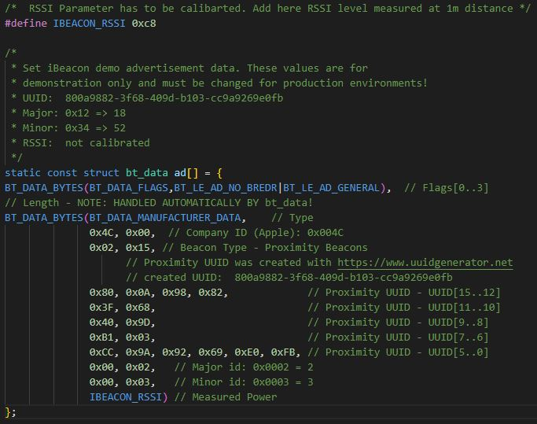
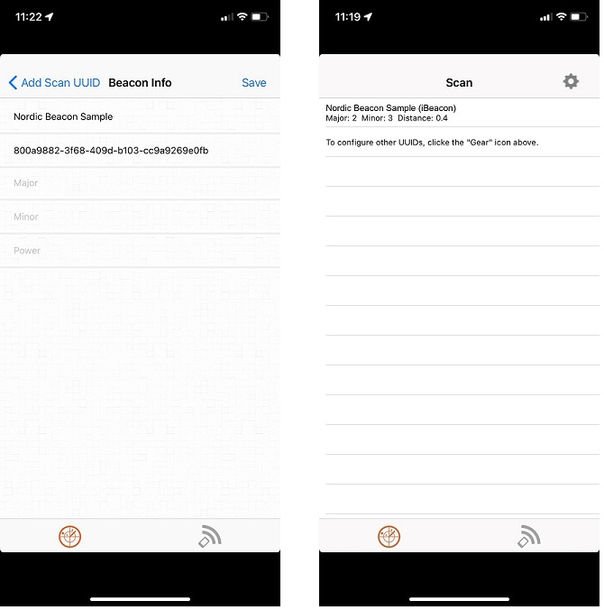

SDK version: NCS v2.3.0  -  Link to Hands-on solution: https://github.com/ChrisKurz/Bluetooth/tree/main/Workspace/NCSv2.3.0/01_Beacon

# Bluetooth Low Energy: Creating a Beacon application

## Introduction

The simplest Bluetooth Low Energy solution is to realize a beacon. The wireless MCU will be used in transmit mode only and 
it will broadcast a defined message. So we have to take care to initialize the Bluetooth stack, define the message that 
should be broadcasted, and start the broadcast. Here we will create an iBeacon application.

## Required Hardware/Software
- one nRF52 development kit (e.g. nRF52DK, nRF52833DK, or nRF52840DK)
- a smartphone ([Android](https://play.google.com/store/apps/details?id=no.nordicsemi.android.mcp&hl=de&gl=US&pli=1) or [iOS](https://apps.apple.com/de/app/nrf-connect-for-mobile/id1054362403)), which runs the __nRF Connect__ app 

   optional you can also use the smartphone app __Locate Beacon__ from Radius Networks ([Android](https://play.google.com/store/apps/details?id=com.radiusnetworks.locate&hl=en&gl=US) or [iOS](https://apps.apple.com/de/app/locate-beacon/id738709014) versions)

- install the _nRF Connect SDK_ v2.3.0 and _Visual Studio Code_. The description of the installation can be found [here](https://developer.nordicsemi.com/nRF_Connect_SDK/doc/2.3.0/nrf/getting_started/assistant.html#).

## Hands-on step-by-step descrition 

The iBeacon specification can be found on the following webpage:
https://developer.apple.com/ibeacon/

Let's start to work on our project.

### Create a project from scratch

1) Create the project folder in your own Workspace directory. Example:    c:/MyWorkspace/01_Beacon

2) Create the needed files for a minimal project setup:
	
   

3) And here is the content of these files:

	  _CMakeLists.txt_
	  
       # SPDX-License-Identifier: Apache-2.0

       cmake_minimum_required(VERSION 3.20.0)

       find_package(Zephyr REQUIRED HINTS $ENV{ZEPHYR_BASE})
       project(MyBeacon)

       target_sources(app PRIVATE src/main.c)
				
	_prj.conf_
	   
       # Enable Bluetooth support
       CONFIG_BT=y
	
	_src/main.c_
		        
       #include <zephyr/kernel.h>
       #include <zephyr/bluetooth/bluetooth.h>
 
       void main (void) {
           printk("Starting MyBeacon application!\n");
       }

### Enable Bluetooth Stack

4) Enable the Bluetooth Stack in the main function:

	_src/main.c_ => main() function
	
           int err;

           /* Initialize the Bluetooth Subsystem */
           err = bt_enable(bt_ready);
           if (err) {
               printk("Bluetooth init failed (err %d)\n", err);
           }

### When Bluetooth Stack is enabled, start Advertising

5) Add bt_ready function to main.c file:

	_src/main.c_

       static void bt_ready(int err){
           if (err) {
               printk("Bluetooth init failed (err %d)\n", err);
                return;
           }

           printk("Bluetooth initialized\n");

           /* Start advertising */
           err = bt_le_adv_start(BT_LE_ADV_NCONN, ad, ARRAY_SIZE(ad), NULL, 0);
           if (err) {
               printk("Advertising failed to start (err %d)\n", err);
               return;
           }

           printk("iBeacon started\n");
       }
	      
### Ensure we use right advertising interval time for iBeacon

6) The iBeacon specification defines a advertising rate. 
   - What advertisting interval has to be set for an iBeacon? 
   - What advertising interval is set in our beacon application? Hint: Check the bt_le_adv_start function parameters. 

### Define which information is sent in the iBeacon protocol

7) Another parameter in bt_le_adv_start function is 'ad'. This parameter allows us to define the broadcasting message. For the iBeacon the specification defines how this message has to look like. Create a 'struct bt_data ad[]' and define the values based on iBeacon specification:

	_src/main.c_

        /*  RSSI Parameter has to be calibarted. Add here RSSI level measured at 1m distance */
        #define IBEACON_RSSI 0xc8

        /*
         * Set iBeacon demo advertisement data. These values are for
         * demonstration only and must be changed for production environments!
         * UUID:  ????????-????-????-????-????????????
         * Major: ???
         * Minor: ???
         * RSSI:  -56 dBm
         */
        static const struct bt_data ad[] = {
            BT_DATA_BYTES(BT_DATA_FLAGS,BT_LE_AD_NO_BREDR|BT_LE_AD_GENERAL),  // Flags[0..3]   
            // Length - NOTE: HANDLED AUTOMATICALLY BY bt_data!
            BT_DATA_BYTES(BT_DATA_MANUFACTURER_DATA,    // Type
            , ,  // Company ID (Apple)
            , , // Beacon Type - Proximity Beacons 
            , , , ,     // Proximity UUID - UUID[15..12] 
            , ,         // Proximity UUID - UUID[11..10] 
            , ,         // Proximity UUID - UUID[9..8] 
            , ,         // Proximity UUID - UUID[7..6] 
            , , , , , , // Proximity UUID - UUID[5..0] 
            , , // Major
            , , // Minor
            IBEACON_RSSI) // Measured Power
        };
	      
    Note: please create a universal unique identifier on https://www.uuidgenerator.net/

    Here is an example how the bt_data_ad parameter may look like:
    

## Testing

8) Build the project and download to your nRF52 development kit.
9) Ensure the code is executed on your development kit. This can be done by connecting the development kit via USB to your computer and opening a terminal program (e.g. Putty or TeraTerm). Terminal program settings:  115200 baud, 8 data bits, 1 stop bit, no parity, no flow control

   You should see following output:
   
   

11) Use your smartphone and look for the iBeacon 

   I have used the __Locate Beacon__ app on an iPhone. Note that the UUID of your beacon has to be added in the Settings. This is used to filter the output in the app. Here is a screen shot of the UUID filter setting, as well as the scan result output.
   
   

NOTE: We have not calibrated the RSSI value in the iBeacon protocol. So the shown distance in the smartphone app may vary a lot!
