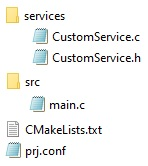
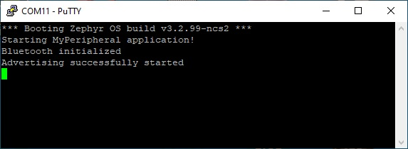

SDK version: NCS v2.3.0  -  Link to Hands-on solution: https://github.com/ChrisKurz/Bluetooth/tree/main/Workspace/NCSv2.3.0/02_Peripheral_DIS

# Bluetooth Low Energy: Peripheral with Device Information Service

## Introduction

The simplest way to use Bluetooth Low Energy is broadcasting and realising a beacon application. But usually a connection between two devices is required. A connection allows to exchange data. Here we take a look on a peripheral solution, which allows to read its Device Information Service. 

## Required Hardware/Software

- one nRF52 development kit (e.g. nRF52DK, nRF52833DK, or nRF52840DK)
- a smartphone ([Android](https://play.google.com/store/apps/details?id=no.nordicsemi.android.mcp&hl=de&gl=US&pli=1) or [iOS](https://apps.apple.com/de/app/nrf-connect-for-mobile/id1054362403)), which runs the __nRF Connect__ app 
- install the _nRF Connect SDK_ v2.3.0 and _Visual Studio Code_. The description of the installation can be found [here](https://developer.nordicsemi.com/nRF_Connect_SDK/doc/2.3.0/nrf/getting_started/assistant.html#).

## Hands-on step-by-step description

### Create a project from scratch

1) Create the project folder in your own Workspace directory. For example:    c:/MyWorkspace/02_Peripheral_DIS

2) Create the needed files for a minimal project setup:

   

3) Here is the content of these files:
	
	  _CMakeLists.txt_
	  
       # SPDX-License-Identifier: Apache-2.0

       cmake_minimum_required(VERSION 3.20.0)

       find_package(Zephyr REQUIRED HINTS $ENV{ZEPHYR_BASE})
       project(MyPeripheralDIS)

       target_sources(app PRIVATE src/main.c)
				
	_prj.conf_
	   
       #=== Enable Bluetooth Stack
       CONFIG_BT=y
       CONFIG_BT_DEVICE_NAME="DIS peripheral"

       #------ Define Bluetooth LE Role 
       #CONFIG_BT_BROADCASTER=y   # note: BROADCASTER is activated by default
       #CONFIG_BT_CENTRAL=n       not used in this example (default value: n)
       #CONFIG_BT_OBSERVER=n      not used in this example (default value: n)
       CONFIG_BT_PERIPHERAL=y
	
	_src/main.c_
		        
	   #include <zephyr/bluetooth/bluetooth.h>
 
	   void main (void) {
	       printk("Starting MyPeripheral application!\n");

       }

Notes: 
- The Bluetooth stack is added by the above KCONIF settings. Beside that a Bluetooth devcie name and peripheral role is defined.
- The prj.conf file contains lines that are commented out (using "#" character). These have been added to allow a better understanding of the setting. Note that CONFIG_BT_BROADCASTER is by default 'y', while Central and Ovserver roles are disabled by default. 

### Add Software module for _Device Instormation Service_ (DIS) and set its paramters

4) This is done via the KCONFIG settings. So we have to add following lines in the __prj.conf__ file:

	_prj.conf_
	   
       #------ Device Information Service (DIS)
       CONFIG_BT_DIS=y

5) The _Device Information Service_ parameters are also defined via KCONFIG. Please check the Bluetooth DIS specification and compare it with the below parameters. (see https://www.bluetooth.com/de/specifications/specs/)

   So we define the DIS parameters by adding following lines in __prj.conf__ file:

	_prj.conf_

       CONFIG_BT_DIS_MANUF="Zephyr"
       CONFIG_BT_DIS_MODEL="Zephyr Model"
       CONFIG_BT_DIS_SERIAL_NUMBER=y
       CONFIG_BT_DIS_SERIAL_NUMBER_STR="Zephyr Serial"
       CONFIG_BT_DIS_HW_REV=y
       CONFIG_BT_DIS_HW_REV_STR="Zephyr Hardware"
       CONFIG_BT_DIS_FW_REV=y
       CONFIG_BT_DIS_FW_REV_STR="Zephyr Firmware"
       CONFIG_BT_DIS_SW_REV=y
       CONFIG_BT_DIS_SW_REV_STR="Zephyr Software"
       CONFIG_BT_DIS_PNP=n
       #CONFIG_BT_DIS_PNP_PID=0x00   not used in this example
       #CONFIG_BT_DIS_PNP_VID=0x00   not used in this example
       #CONFIG_BT_DIS_PNP_VID_SRC=1  not used in this example
       #CONFIG_BT_DIS_PNP_VER=0x01   not used in this example

6) Some Bluetooth services require in the Zephyr project interaction with the user main function. The appropriate API functions are declared in dedicated service header file that are located in folder __zephyr/include/zephyr/bluetooth/services__. 

   The _Device Information Service_ does not require such API functions. Nevertheless, an empty header file was prepared for it. So including a header for DIS would not be needed, but for completness we will also include the DIS header file in our project. Add following line in main.c file:

	_src/main.c_
	
       #include <zephyr/bluetooth/services/dis.h>

### Enable Bluetooth Stack

7) Enable the Bluetooth Stack in the main function:

	_src/main.c_ => main() function

           int err;

           /* Initialize the Bluetooth Subsystem */
           err = bt_enable(NULL);
           if (err) {
               printk("Bluetooth init failed (err %d)\n", err);
               return;
           }
           printk("Bluetooth initialized\n");

### Add handling of connect/disconnect events

8) We need to include the conn.h header file to get access to the appropriated definitions for connection handling. So we add following line:

	_src/main.c_

       #include <zephyr/bluetooth/conn.h> 

9) We define two callback functions, which are called by the Bluetooth stack. The execution of these callback functions is triggered when a connection is established, or a disconnect happnes. Let's prepare the appropriate structure.

   There are two possibilites. Either you use the Macro that is defined in the Bluetooth stack or you define it as a structure.

   - Either use the pre-defined macro from the Bluetooth Stack, ...

	_src/main.c_

       /* Register a callback structure for connection events. */
       BT_CONN_CB_DEFINE(conn_callbacks) = {
           .connected = connected,
           .disconnected = disconnected,
       };
       
      NOTE: Calling the function _bt_conn_cb_register()_ is not needed when using the macro!       

   - ... or define the callback structure in the following way:

	_src/main.c_

       static struct bt_conn_cb conn_callbacks = {
           .connected = connected,
           .disconnected = disconnected,
       };

       void main(void) {
           ...
           /* Register a callback structure for connection events. */
           bt_conn_cb_register(&conn_callbacks);
           ....	  
       }

10) Define the Callback functions used for a connect or disconnect events. In our case we will use these functions just for debug messages. 

	_src/main.c_

       static void connected(struct bt_conn *conn, uint8_t err)
       {
           if (err) {
                printk("Connection failed (err 0x%02x)\n", err);
           } else {
                printk("Connected\n");
           }
       }

       static void disconnected(struct bt_conn *conn, uint8_t reason)
       {
           printk("Disconnected (reason 0x%02x)\n", reason);
       }

### Start Advertising

11) First, we include the uuid.h heard fil into our project. There are pre-defined UUIDs of standard Bluetooth Services and Characteristics. Beside that if offers also macros that are used to create the advertising data. 

	_src/main.c_

        #include <zephyr/bluetooth/uuid.h>

12) Next, we add an advertising_start function. The advertising will be started on different places in our code. So using a function makes sense. Add following code to main.c file:

	_src/main.c_

        static const struct bt_data ad[] = {
            BT_DATA_BYTES(BT_DATA_FLAGS, (BT_LE_AD_GENERAL | BT_LE_AD_NO_BREDR)),
            BT_DATA_BYTES(BT_DATA_UUID16_ALL, BT_UUID_16_ENCODE(BT_UUID_DIS_VAL)),
        };

        void start_advertising(void)
        {
            int err;
	   
            err = bt_le_adv_start(BT_LE_ADV_CONN_NAME, ad, ARRAY_SIZE(ad), NULL, 0);
            if (err) {
                printk("Advertising failed to start (err %d)\n", err);
            }
            else {
                printk("Advertising successfully started\n");
            }
        }

13) We will start adertising in main function, when the bluetooth stack was successfully started. Add following line: 

	_src/main.c_ => main() function
             
            start_advertising();

14) And we start advertising again when a disconnect happened. So add following line in the __disconnected()__ function:

	_src/main.c_ => disconnected() function
             
            start_advertising();

## Testing
15) Build the project and download to an nRF52-DK or nRF52840-DK.
16) Ensure the code is executed on your development kit. This can be done by connecting the development kit via USB to your computer and opening a terminal program (e.g. Putty or TeraTerm). Terminal program settings:  115200 baud, 8 data bits, 1 stop bit, no parity, no flow control

   You should see following output:
   
   

17) Use a smartphone and the nRF Connect app and look for "DIS peripheral" device. Check the GATT database.

   Here is a screen shot of an iPhone showing the GATT database:
   
   

