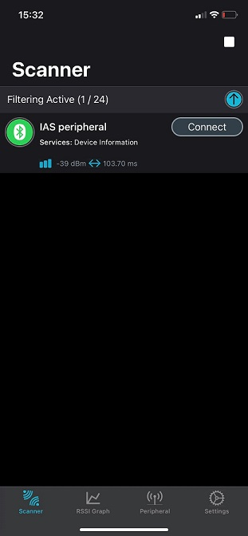
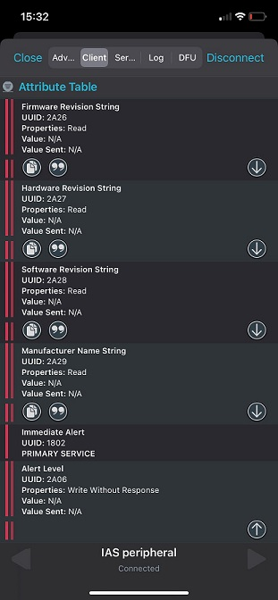

SDK version: NCS v2.3.0  -  Link to Hands-on solution: https://github.com/ChrisKurz/Bluetooth/tree/main/Workspace/NCSv2.3.0/02a_Peripheral_IAS

# Bluetooth Low Energy: Peripheral with Immediate Alert Service

## Introduction

Another service, beside _Device Information Service_, is the _Immediate Alert Service_ (IAS). Here we will add the IAS service to our project.

## Required Hardware/Software

- one nRF52 development kit (e.g. nRF52DK, nRF52833DK, or nRF52840DK)
- a smartphone, which runs the __nRF Connect__ app ([Android](https://play.google.com/store/apps/details?id=no.nordicsemi.android.mcp&hl=de&gl=US&pli=1) or [iOS](https://apps.apple.com/de/app/nrf-connect-for-mobile/id1054362403))
- install the _nRF Connect SDK_ v2.3.0 and _Visual Studio Code_. The description of the installation can be found [here](https://developer.nordicsemi.com/nRF_Connect_SDK/doc/2.3.0/nrf/getting_started/assistant.html#).

## Hands-on step-by-step description

### Let's copy the previous project

1) Make a copy of the project "Peripheral with Device Information Service". 

   If you haven't done the this hands-on exercise, you can also download the Custom Service project [here](https://github.com/ChrisKurz/Bluetooth/tree/main/Workspace/NCSv2.3.0/02_Peripheral_DIS).

2) Let's change the Bluetooth Device name of this project. Look for __CONFIG_BT_DEVICE_NAME="DIS peripheral"__ in the _prj.conf_ file and replace it by following line:

	_prj.conf_
	   
       CONFIG_BT_DEVICE_NAME="IAS peripheral"

3) The IAS service unfortunately uses the Bluetooth disconnect callback function. So we have to remove the __disconnected()__ function definition from our user application.

### Add Software module for _Immediate Alert Service_ (IAS)

4) This is done via the KCONFIG settings. So we have to add following lines in the __prj.conf__ file: 

	_prj.conf_
	   
       #------ Immediate Alert Service (IAS)
       CONFIG_BT_IAS=y

   NOTE: Detailed information about the IAS service can be found in the Bluetooth IAS specification. (see https://www.bluetooth.com/de/specifications/specs/)

5) Some Bluetooth services require in the Zephyr project interaction with the user main function. The appropriate API functions are declared in dedicated service header file that are located in folder __zephyr/include/zephyr/bluetooth/services__. 

   The _Immediate Alert Service_ requires such API functions. So we have to include the IAS header file in our project. Add following line in main.c file:

	_src/main.c_
	
       #include <zephyr/bluetooth/services/ias.h>

### Handling of Alerts in user application

6) The IAS service implmentation allows you to define callback functions for the different alerts. IAS specification defines three alerts: No Alert, Mild Alert, and High Alert. Let's define for each Alert level an own callback function. 

	_src/main.c_

       BT_IAS_CB_DEFINE(ias_callbacks)={
           .no_alert=   ias_no_alert,
           .mild_alert= ias_mild_alert,
           .high_alert= ias_high_alert,
       };

7) The missing part now is just to define the callback functions. We use here just debug messages. A real application would use these function to start a alarm (e.g. flashing, sound, vibration, or similar alert notifications). 

	_src/main.c_

       void ias_no_alert(void)
       {
           printk("IAS: Stop Alert\n");
       }
       
       void ias_mild_alert(void)
       {
           printk("IAS: Mild Alert\n");
       }
       
       void ias_high_alert(void)
       {
           printk("IAS: High Alter\n");
       }
       
## Testing
8) Build the project and download to an nRF52-DK or nRF52840-DK.
9) The terminal program should output following messages after a reset:

   

10) Use the smartphone, start the _nRF Connect_ app, and start scanning. You should find the "IAS peripheral" device:

   
   
11) Press the "Connect" button. A connection will be established. If this was done, check the GATT database:

   

12) In the GATT database on the smartphone click the "Alert level". You will then be asked to enter a value. Enter an UnsignedInt value (0 => no alter, 1 => mild altert, or 3 => high alter).

      
  
13) Please check the output in the terminal program, after pressing the "Write" button.

      
  
