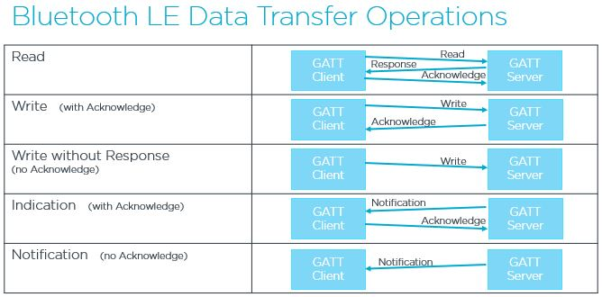
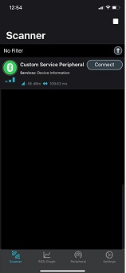
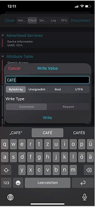

SDK version: NCS v2.3.0  -  Link to Hands-on solution: https://github.com/ChrisKurz/Bluetooth/tree/main/Workspace/NCSv2.3.0/03_Peripheral_CustomService

# Bluetooth Low Energy: Peripheral with a user-defined Service (Custom Service) - _Write without Response_

## Introduction

The Bluetooth Standard mentions different data transfer operations. An overview is shown in this picture:

In this hands-on we use the "write without response" transfer operation. A smartphone takes over the role as the GATT Client, and a nRF52 development kit (e.g. nRF52840DK) is used as the GATT Server. 

## Required Hardware/Software

- one nRF52 development kit (e.g. nRF52DK, nRF52833DK, or nRF52840DK)
- a smartphone ([Android](https://play.google.com/store/apps/details?id=no.nordicsemi.android.mcp&hl=de&gl=US&pli=1) or [iOS](https://apps.apple.com/de/app/nrf-connect-for-mobile/id1054362403)), which runs the __nRF Connect__ app 
- install the _nRF Connect SDK_ v2.3.0 and _Visual Studio Code_. The description of the installation can be found [here](https://developer.nordicsemi.com/nRF_Connect_SDK/doc/2.3.0/nrf/getting_started/assistant.html#).

## Hands-on step-by-step description

### Prepare the project

1) Make a copy of the previous project (Peripheral with Device Information Service). We will add a custom service and characteristic to this project.

   In case you haven't done the this hands-on exercise, you can also download the Custom Service project [here](https://github.com/ChrisKurz/Bluetooth/tree/main/Workspace/NCSv2.3.0/02_Peripheral_DIS).

2) Add new folder "services" to the project. Create the files CustomService.c and CustomService.h in this new folder.

   So, the file/folder structure in your project folder should look like this:

   

3) Add CustomSerice.c file to your project by changing the CMakeLists.txt file:
	
	  _CMakeLists.txt_
	  
       # SPDX-License-Identifier: Apache-2.0

       cmake_minimum_required(VERSION 3.20.0)

       find_package(Zephyr REQUIRED HINTS $ENV{ZEPHYR_BASE})
       project(MyPeripheralCusSer)

       target_sources(app PRIVATE src/main.c
                                  services/CustomService.c)
			
			
### Adding Custom Service

4) We need a transmission buffer for transmitting data. Add following lines to CustomService.c:

	_services/CustomService.c_
	
       #include "CustomService.h"

       #define MAX_TRANSMIT_SIZE 240
       uint8_t data_buffer[MAX_TRANSMIT_SIZE];

       int CustomService_init(void)
       {   int err = 0;
   
           memset(&data_buffer, 0, MAX_TRANSMIT_SIZE);
           return err;
       }

5) Add the declaration of CustomService_init() function to CustomService.h header file:

	_services/CustomService.h_

       int CustomService_init(void); 

6) We need for the Custom Service a UUID and also for the Custom Characteristic. Create two UUIDs on https://www.uuidgenerator.net.
And add it to CusomtService.c:

	_services/CustomService.c_

       /*Note that UUIDs have Least Significant Byte ordering */
       #define CUSTOM_SERVICE_UUID        0xd4, 0x86, 0x48, 0x24, 0x54, 0xB3, 0x43, 0xA1, 0xBC, 0x20, 0x97, 0x8F, 0xC3, 0x76, 0xC2, 0x75                       
       #define CUSTOM_CHARACTERISTIC_UUID 0xED, 0xAA, 0x20, 0x11, 0x92, 0xE7, 0x43, 0x5A, 0xAA, 0xE9, 0x94, 0x43, 0x35, 0x6A, 0xD4, 0xD3

7) The custom UUIDs have to be declared. Add following lines in CustomService.c:

	_services/CustomService.c_

       #define BT_UUID_CUSTOM_SERIVCE         BT_UUID_DECLARE_128(CUSTOM_SERVICE_UUID)
       #define BT_UUID_CUSTOM_CHARACTERISTIC  BT_UUID_DECLARE_128(CUSTOM_CHARACTERISTIC_UUID)

   This also requires to add the bluetooth uuid.h header file to the CustomService.c file:

	_services/CustomService.c_
	
       #include <zephyr/bluetooth/uuid.h>

8) We need to define and register our service and its characteristics. By using the following helper macro we statically register our Service in our BLE host stack.

   Add the following lines __after the lines we added in step 7__ in CustomService.c:

	_services/CustomService.c_

       /* Custom Service Declaration and Registration */
       BT_GATT_SERVICE_DEFINE(CustomService,
                       BT_GATT_PRIMARY_SERVICE(BT_UUID_CUSTOM_SERIVCE),
                       BT_GATT_CHARACTERISTIC(BT_UUID_CUSTOM_CHARACTERISTIC,
                                              BT_GATT_CHRC_WRITE_WITHOUT_RESP,
                                              BT_GATT_PERM_READ | BT_GATT_PERM_WRITE, 
                                              NULL, on_receive, NULL),
       );

   And this also requires the gatt.h header file. Include it in the CustomServices.c file:
   
   	_services/CustomService.c_
   
       #include <zephyr/bluetooth/gatt.h>   

### Add data transfer (Write without Response) to the project

9) Now add the function that takes care about getting a trigger if data is received. Add the following to CustomService.c:

	_services/CustomService.c_

       /* This function is called whenever the RX Characteristic has been written to by a Client */
       ssize_t on_receive(struct bt_conn *conn,
                                 const struct bt_gatt_attr *attr,
                                 const void *buf,
                                 uint16_t len,
                                 uint16_t offset,
                                 uint8_t flags)
       {
          const uint8_t * buffer = buf;
    
          printk("Received data: handle=%d, conn=%p, data=0x", attr->handle, conn);
          for(uint8_t i = 0; i < len; i++){
               printk("%02X", buffer[i]);
          }
          printk("\n");
          return len;
       }

### Handling of Custom Service in main() function

10) Include CustomService.h in your main.c file. Add following line in main.c:

	_services/main.c_

        #include "../services/CustomService.h"

10) We initialize our service by adding the following after enabling the Bluetooth stack in main.c:

	_services/main.c_ => main() function

            //Initalize services
            err = CustomService_init();
            if (err) {
                printk("Custom Service initialization failed!\n");
                return;
            }

11) You can now also chance the Bluetooth Device name by changing the CONFIG_BT_DEVICE_NAME setting in the prj.conf file. 

	_prj.conf_

        CONFIG_BT_DEVICE_NAME="Custom Service Peripheral"

### Testing

12) Finally, build the project ("Pristine Build"!!!), start debugger, and test. 
 
    Use Terminal program (e.g. nRF Terminal) to check the debug output. First connect Terminal, then perfrom a reset by pressing the reset button on the development kit. Following output should be seen on the terminal:
    
    
    
    Use the _nRF Connect_ Smartphon app and start scanning. The app should find our device (device name: "Custom Service Peripheral")
    
    
    
    Click in the smartphone app the "Connect" button. Now a connection between the smartphone and the developement kit is established. In the Terminal you should see that the device went into "Connected" mode. 
    
    
    
    And the smartphone should list the GATT database content in the "Client" tab:
    
    
    
    In the GATT database you find an "Unkown Service" and an "Unknown Characteristic". Check its UUIDs and compare it to the UUIDs we defined in step 6.

    Open the "Unknown Characteristic" (click on the button with the arrow beside this chacteristic) and enter a hex value. For example: CAFE
    
    
    
    Click on the "Write" button. 
    
    In the Terminal program you should see that the hex values were received:
    
    
