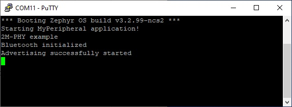
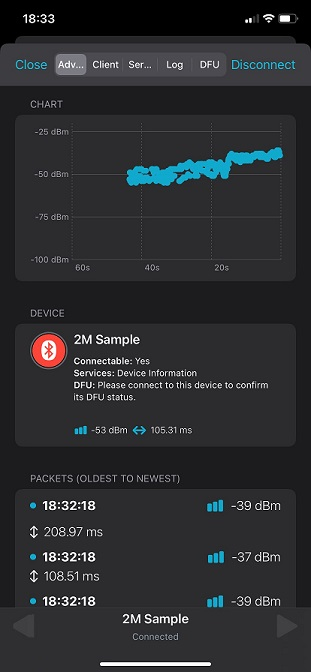

SDK version: NCS v2.2.0  -  Link to Hands-on solution: https://github.com/ChrisKurz/Bluetooth/tree/main/Workspace/NCSv2.3.0/06_Peripheral_2MPHY

# Bluetooth Low Energy: Using 2M PHY

## Introduction

The Bluetooth LE radio transmission is made with a symbol rate of 1 Mbps ("1M PHY") by default. In the Bluetooth standard 5.x, a double symbol rate of 2Mpbs was introduced - the so-called "2M PHY". 
Every connection in Bluetooth Low Energy starts with the 1M PHY. It is the task of the application to request a switch to the 2M PHY. In case both sides are capable to use the 2 Mbps 
symbol rate, both sides switch over to 2M PHY for transmit and receive. 

Note that using the 2M PHY increases the throughput, but with the drawback of a shorter range (about 80% of 1M PHY).

## Required Hardware/Software

- one nRF52 development kit (e.g. nRF52DK, nRF52833DK, or nRF52840DK)
- a smartphone that supports 2M PHY 
- install the _nRF Connect SDK_ v2.3.0 and _Visual Studio Code_. The description of the installation can be found [here](https://developer.nordicsemi.com/nRF_Connect_SDK/doc/2.3.0/nrf/getting_started/assistant.html#).

## Hands-on step-by-step description

### Let's start with an existing 1M PHY example

We will use one of the previous examples and add the handling that is needed to switch to 2M PHY. 

1) Make a copy of the project "Peripheral with a Custom Service". 

   If you haven't done the this hands-on exercise, you can also download the Custom Service project [here](https://github.com/ChrisKurz/Bluetooth/tree/main/Workspace/NCSv2.3.0/02_Peripheral_DIS).

### Enable 2M PHY

2) Enable support for Bluetooth 5.0 2Mbps PHY in the Controller. Add following lines in __prj.conf__ file:

	_prj.conf_
   
       #------ Enable 2M PHY
       CONFIG_BT_PHY_UPDATE=y
       CONFIG_BT_AUTO_PHY_UPDATE=n
       CONFIG_BT_USER_PHY_UPDATE=y
       CONFIG_BT_CTLR_PHY_2M=y

### Change Bluetooth Device Name

3) In the previous example we used the Bluetooth device name "Custom Service Peripheral". Let's change this name by upating the string in the CONFIG_BT_DEVICE_NAME devinition in the prj.conf file:

	_prj.conf_
       
       CONFIG_BT_DEVICE_NAME="2M-PHY Sample"

### Modify Application Banner

4) A string is sent to the terminal, when the application is starting. So let's add a project specific output and add at the beginning of the main function followibng line:

	_src/main.c_ => main() function
   
           printk("2M-PHY example\n");

### Request PHY update 

5) add following function:

	_src/main.c_

       static void request_phy_update(struct bt_conn *conn)
       {
           int err;

           err = bt_conn_le_phy_update(conn, BT_CONN_LE_PHY_PARAM_2M);
           if (err) {
               printk("PHY update request failed: %d\n",  err);
           }
       }

6) The PHY update request has to be done as soon as the connection is established. So add following lines in function __connected()__ just after the _printk("Connected\n";_ command:

	_src/main.c_ => connected() function

               printk("Request PHY Update (2M PHY)\n");
               request_phy_update(conn);

### Add debugging info

7) Our development kit should also report in the terminal when the PHY update was done. We can use a callback, which is used when a PHY update happened. So we add following function to our code:

	_src/main.c_

       static const char *phy2str(uint8_t phy)
       {
           switch (phy) {
               case 0: return "No packets";
               case BT_GAP_LE_PHY_1M: return "LE 1M PHY";
               case BT_GAP_LE_PHY_2M: return "LE 2M PHY";
               case BT_GAP_LE_PHY_CODED: return "LE Coded PHY";
               default: return "Unknown";
           }
       }

       static void le_phy_updated(struct bt_conn *conn,
               struct bt_conn_le_phy_info *param)
       {
           printk("LE PHY updated: TX PHY %s, RX PHY %s\n",
                    phy2str(param->tx_phy), phy2str(param->rx_phy));
       }

8) We also have to register the callback function _le_phy_updated()_. This is done by adding following line tothe __conn_callback__ definition:

	_src/main.c_ => conn_callbacks structure definition

           .le_phy_updated = le_phy_updated,

## Testing

9) Build and flash the project on your nRF52 developement kit. 

10) open a terminal program (e.g. Putty). Settings: 115200 baud, 8 data bits, 1 stop bit, no flow control

11) Press the RESET button on your developemnt kit. Now you should see following output:

12) Start __nRF Connect__ app on your smartphone and start scanning. You should find the "2M Sample" device, as it is shown here in the iOS _nRF Connect_ app:

13) Press the __Connect__ button in the _nRF Connect_ app on your smartphone. After pressing the __Connect__ button you should se something like this on the smartphone (in this case it is the iPhone app, Android app looks a little bit different):

14) Check the output in your terminal. In case the smartphone supports the LE 2M PHY, then you should see following messages:

