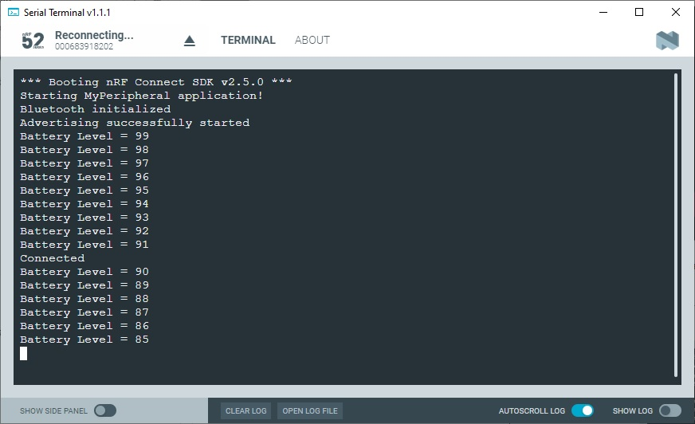

SDK version: NCS v2.5.0  -  Link to Hands-on solution: https://github.com/ChrisKurz/Bluetooth/tree/main/Workspace/NCSv2.5.0/02b_Peripheral_BAS

# Bluetooth Low Energy: Peripheral with Battery Service

## Introduction

Another service is the _Battery Service_ (BAS). Here we will add the BAS service to our project.

## Required Hardware/Software

- a nRF52 development kit (e.g. nRF52DK, nRF52833DK, or nRF52840DK)
- a smartphone ([Android](https://play.google.com/store/apps/details?id=no.nordicsemi.android.mcp&hl=de&gl=US&pli=1) or [iOS](https://apps.apple.com/de/app/nrf-connect-for-mobile/id1054362403)), which runs the __nRF Connect__ app 
- install the _nRF Connect SDK_ v2.5.0 and _Visual Studio Code_. The description of the installation can be found [here](https://developer.nordicsemi.com/nRF_Connect_SDK/doc/2.5.0/nrf/getting_started/assistant.html#).

## Hands-on step-by-step description

### Let's copy the previous project

1) Make a copy of the project "Peripheral with Device Information Service". 

   If you haven't done the this hands-on exercise, you can also download this project [here](https://github.com/ChrisKurz/Bluetooth/tree/main/Workspace/NCSv2.5.0/02_Peripheral_DIS).

2) Let's change the Bluetooth Device name of this project. Look for __CONFIG_BT_DEVICE_NAME="DIS peripheral"__ in the _prj.conf_ file and replace it by following line:

	_prj.conf_
	   
       CONFIG_BT_DEVICE_NAME="BAS peripheral"

### Add Software module for _Battery Service_ (BAS)

4) This is done via the KCONFIG settings. So we have to add following lines in the __prj.conf__ file: 

	_prj.conf_
	   
       #------ Battery Service (BAS)
       CONFIG_BT_BAS=y

   NOTE: Detailed information about the BAS service can be found in the Bluetooth BAS specification. (see https://www.bluetooth.com/de/specifications/specs/)

5) Some Bluetooth services require in the Zephyr project interaction with the user main function. The appropriate API functions are declared in dedicated service header file that are located in folder __zephyr/include/zephyr/bluetooth/services__. 

   The _Battery Service_ requires such API functions. So we have to include the BAS header file in our project. Add following line in main.c file:

      _src/main.c_
	
       #include <zephyr/bluetooth/services/bas.h>

### Handling of Battery Level

6) In a real application the ADC is used to measure the battery charge. In our simple example here we will emulate the measurement. So the value of will be decreased each second, until 0 is reached. Then we set the battery level again to 100.

   First we declare a variable, which holds the battery level in percent.

      _src/main.c_ => add in main() function 

           uint8_t battLevel=0;

   Then we add an entire loop in main() function and emulate the battery discharbe by decreasing the variable each second. 

      _src/main.c_ => add in main() function 

           while(1){
               battLevel=battLevel-1;
               if (battLevel==0) {
                   battLevel=100;
               }
               k_sleep(K_SECONDS(1));
           }

### Passing Battery Level to GATT characteristic

7) Making the battery level available in a Bluetooth LE GATT characteristic is done by using the API function call _bt_bas_set_battery_level()_ from the BAS serivce that we have inlcuded into our project. So add following line in the main's entire loop.

     _src/main.c_ => add in main() functions __while(1)__ loop 

               err=bt_bas_set_battery_level(battLevel);
               if(err!=0){
                   printk("Error: could not set battery level! (Error Code= %i)\n",err);
               }
               printk("Battery Level = %i\n",battLevel);

## Testing
8) Build the project and download to an nRF52-DK or nRF52840-DK.
9) Use a smartphone and the nRF Connect app. Connect to "BAS peripheral" device.
10) Check the GATT database and look for Battery Level service. Enable Notification by pressing the mulitple arrows shown in the _Battery Level_ characteristic. 

   

11) Now, you should see that the battery level in the smartphone app is updated each second.
12) Check also the output in a serial terminal. You should see that the smartphone app and the terminal outputs the same battery level value.

   
   

