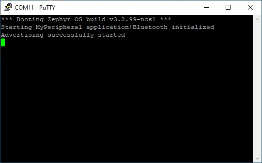
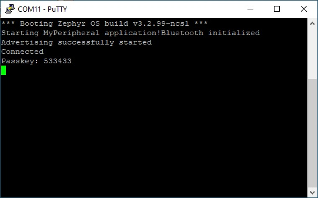
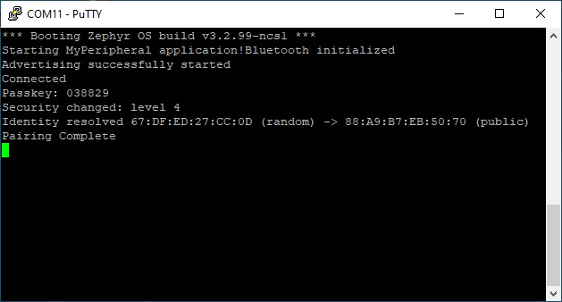

SDK version: NCS v2.5.0  -  Link to Hands-on solution: https://github.com/ChrisKurz/Bluetooth/tree/main/Workspace/NCSv2.5.0/10_Peripheral_Security 

# Bluetooth Low Energy: Enable Security on a Bluetooth Peripheral Device

## Introduction
In the previous chapters, we did not take care of security. We had established a connection. Once the connection is established, these devices can communicate with each other and exchange data. We did not check whether the device that wanted to connect was authorized to do so. So any device could connect. 

Next, here we will add a request for a passkey that allows devices to connect only if the user has both devices in front of him. The passkey used here is usually a random number that is generated within the Bluetooth stack.

## Required Hardware/Software

- one nRF52 development kit (e.g. nRF52DK, nRF52833DK, or nRF52840DK)
- a smartphone ([Android](https://play.google.com/store/apps/details?id=no.nordicsemi.android.mcp&hl=de&gl=US&pli=1) or [iOS](https://apps.apple.com/de/app/nrf-connect-for-mobile/id1054362403)), which runs the __nRF Connect__ app 
- install the _nRF Connect SDK_ v2.5.0 and _Visual Studio Code_. The description of the installation can be found [here](https://developer.nordicsemi.com/nRF_Connect_SDK/doc/2.5.0/nrf/getting_started/assistant.html#).

## Hands-on step-by-step description

### Prepare the project

1) Make a copy of the project [Peripheral with a Custom Service](https://github.com/ChrisKurz/Bluetooth/tree/main/Workspace/NCSv2.5.0/03_Peripheral_CustomService). In the next steps we will modify this project and enable security.

### Adding required Software Modules (Libraries)

We have already added the basic Bluetooth software modules in the previous project. Here we will add the security specific software modules.

2) So to add the protocol support for the Security Manager (SM) we have to add following lines to the project's _prj.conf_ file:

       #------ Add Bluetooth Security Manager
       CONFIG_BT_SMP=y
       CONFIG_BT_SMP_SC_ONLY=y

   CONFIG_BT_SMP activates support for the Security Manager Protocol (SMP) and enables devices to be paired via Bluetooth LE. 

   CONFIG_BT_SMP_SC_ONLY activates support for Secure Connection Only Mode. In this mode, the device may only use Security Mode 1 Level 4, with the exception of services that only require Security Mode 1 Level 1 (no security). Security Mode 1 Level 4 stands for authenticated LE Secure Connections pairing with encryption. Activating this option disables legacy pairing. 

### Change Security Level as soon as a Connection is established

3) We increase the security level after a Connection was established. So using the _connected()_ callback function allows us to detect when the connection was done. And here we can then increase the security level.

   Add following lines in the main.c file and its function _connected()_ (add it after the __printk("Connected\n");__ instruction):

               if (bt_conn_set_security(conn, BT_SECURITY_L4)) {
                   printk("Failed to set security\n");
               }

### Add Bluetooth Passkey handling to the project

4) The passkey handling is also done via callback functions. First we define the necessary callback functions. We define the following structure in our main.c file.

       static struct bt_conn_auth_cb auth_cb_display = {
               .passkey_display = auth_passkey_display,
               .passkey_entry = NULL,
       };

       static struct bt_conn_auth_info_cb auth_cb_info = {
               .pairing_failed = pairing_failed,
       };

   Note: __.passkey_entry=NULL,__ is defined as NULL. In our project we will show the passkey in the terminal, and the entry has to be done by the other device. 

5) Now, we have to register the identity and security callback functions, before starting advertising in main() function.

   So add following lines before starting advertising (_err=bt_le_adv_start(...)_):

           bt_conn_auth_cb_register(&auth_cb_display);
           bt_conn_auth_info_cb_register(&auth_cb_info);

6) The function __auth_passkey_display()__ is used to show the passkey on a display of the Bluetooth peripheral device. Our example here is extremely simple. We use the terminal (i.e. UART or RTT connection to the computer via USB) to display the passkey. 

   Add the following function in main.c file:

       static void auth_passkey_display(struct bt_conn *conn, unsigned int passkey)
       {
            printk("Passkey: %06u\n", passkey);
       }

   Note: The generated passkey here is a random number. The passkey will be in the range 0 to 999999, and is expected to be padded with zeroes so that six digits are always shown. It is generated by the Bluetooth stack. With each restart of the microcontroller a new passkey is generated. 

7) In case the authentication fails, I would like even the Bluetooth Connection to be disconnected then. We also use the following function to output an appropriate debug message. 

       static void pairing_failed(struct bt_conn *conn, enum bt_security_err reason)
       {
           printk("Pairing Failed (%d). Disconnecting.\n", reason);
           bt_conn_disconnect(conn, BT_HCI_ERR_AUTH_FAIL);
       }

### Adding Debug Messages

The code we created above is already running. There are already some debug messages included above. However, in case of a problem we will not really see what is exactly happening. So recommendation is to add debug messages in the project. We will also use callback function as triggers to output such debug messages. 

#### Debug Message: Pairing Completed

8) Another helpful debug functionality is probably to provide feedback once pairing and authentication has been successfully completed. We use the following function for this, which only outputs a debug message.

       static void pairing_complete(struct bt_conn *conn, bool bonded)
       {
           printk("Pairing Complete\n");
       }

9) The function _pairing_complete()_ is called via the callback function pairing_completed of the Bluetooth stack. For this purpose, we must add the following line to the __bt_conn_auth_info_cb__ structure:

               .pairing_complete = pairing_complete,
            
   When we addid this line the complete structure definition should look like this:
   
   

#### Debug Message: Identity resolved

10) Add the following line to the __static struct bt_conn_cb conn_callbacks={}__ structure:

            .identity_resolved = identity_resolved,

   So after adding this line the structure definition should look like this:
   
   .jpg)

11) We defined that callback function should be used. The functions itself was not added yet. This is done by adding following code:

   This function should be placed before the __static struct bt_conn conn_callbacks={}__ definition:

    static void identity_resolved(struct bt_conn *conn, const bt_addr_le_t *rpa, const bt_addr_le_t *identity)
    {
        char addr_identity[BT_ADDR_LE_STR_LEN];
        char addr_rpa[BT_ADDR_LE_STR_LEN];

        bt_addr_le_to_str(identity, addr_identity, sizeof(addr_identity));
        bt_addr_le_to_str(rpa, addr_rpa, sizeof(addr_rpa));

        printk("Identity resolved %s -> %s\n", addr_rpa, addr_identity);
    }

#### Debug Message: Security changed

12) Add the following line to the __static struct bt_conn_cb conn_callbacks={}__ structure:

            .security_changed = security_changed,

   So the complete structure definition looks like this:
   
   .jpg)

13) And the appropriate function looks like this:

        static void security_changed(struct bt_conn *conn, bt_security_t level, enum bt_security_err err)
        {
            if (!err) {
                printk("Security changed: level %u\n", level);
            } else {
                printk("Security failed: level %u err %d\n", level, err);
            }
        }

#### Debug Message: Pairing cancelled

14) The following function is mainly for debug purposes. Here a feedback is made if the passkey input was aborted.

        static void auth_cancel(struct bt_conn *conn)
        {
            char addr[BT_ADDR_LE_STR_LEN];

            bt_addr_le_to_str(bt_conn_get_dst(conn), addr, sizeof(addr));
            printk("Pairing cancelled: %s\n", addr);
        }

15) The definition that __auth_cancel()__ is a callback function is done by adding following line to the __static struct bt_conn_auth_cb auth_cb_display__ structure.

                .cancel = auth_cancel,

   The complete structure should then look like this:
   
   

## Testing

16) build and flash the code on an nRF52 development kit. 
17) start a terminal program (e.g. Putty) and select the appropriate COM port. Settings: 11520 baud, 8 data bits, 1 stop bit, no flow control
18) Push the reset button on the nRF52 development kit. You should see following output on the terminal:

   
   
19) Start the _nRF Connect_ smartphone app. Start scanning. Our device should be listed. 

   

20) Press the "Connect" button in the smartphone app. You should now see that the passkey is shown in the terminal:

   

21) The smartphone asks to enter the passkey. Enter the passkey exactly as it is shown in the terminal.

   

22) You should now see that the terminal states the security level, the bluetooth address, and the statement that pairing is completed. 

   

NOTE: The smartphone stores the information about the paired devices. So after a reset or power-cycle the nRF52 development board will loose all pairing information. So it cannot connect to the smartphone again. To allow another pairing the pairing information on the smartphone has to be erased. This can usually be done in the Bluetooth settings of the smartphone. 

The next hands-on will show how to store the pairing info also on the nRF52 development kit. 
