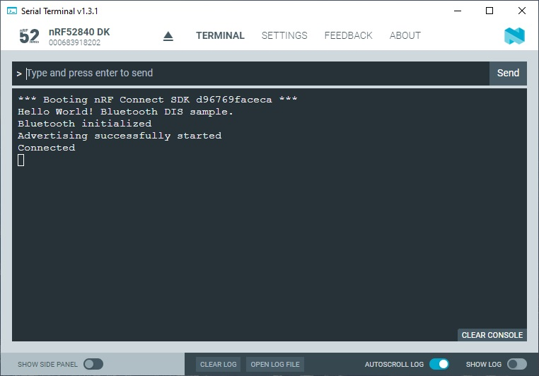
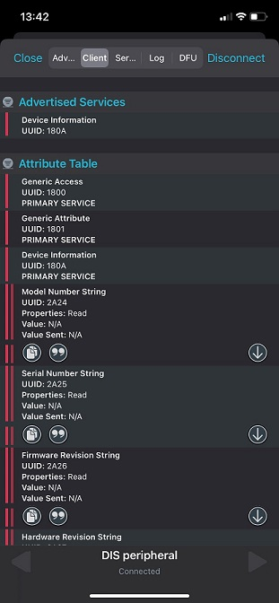

SDK version: NCS v2.6.0  -  Link to Hands-on solution: https://github.com/ChrisKurz/Bluetooth/tree/main/Workspace/NCSv2.6.0/02_Peripheral_DIS

# Bluetooth Low Energy: Peripheral with Device Information Service

## Introduction

The simplest way to use Bluetooth Low Energy is broadcasting and realising a beacon application. But usually a connection between two devices is required. A connection allows to exchange data. Here we take a look on a peripheral solution, which allows to read its Device Information Service. 

## Required Hardware/Software
- Development kit [nRF52840DK](https://www.nordicsemi.com/Products/Development-hardware/nRF52840-DK), [nRF52833DK](https://www.nordicsemi.com/Products/Development-hardware/nRF52833-DK), or [nRF52DK](https://www.nordicsemi.com/Products/Development-hardware/nrf52-dk)
- a smartphone ([Android](https://play.google.com/store/apps/details?id=no.nordicsemi.android.mcp&hl=de&gl=US&pli=1) or [iOS](https://apps.apple.com/de/app/nrf-connect-for-mobile/id1054362403)), which runs the __nRF Connect__ app 
- install the _nRF Connect SDK_ v2.6.0 and _Visual Studio Code_. The installation process is described [here](https://academy.nordicsemi.com/courses/nrf-connect-sdk-fundamentals/lessons/lesson-1-nrf-connect-sdk-introduction/topic/exercise-1-1/).

## Hands-on step-by-step description

### Create a new Project

1) Make a copy of the [Creating a Project from Scratch](https://github.com/ChrisKurz/nRF_Connect_SDK/tree/main/Workspace/NCSv2.6.0/hello_world) hands-on and store it in your workspace folder, e.g.  C:/Nordic/Workspace/02_Peripheral_DIS 

2) Start Visual Studio Code and open the __02_Peripheral_DIS__ project.

### Enable Bluetooth Stack 

3) Add Bluetooth software module to the application by setting the appropriate Kconfig.

   _prj.conf_

       # Enable Bluetooth support
       CONFIG_BT=y

4) Enable the Bluetooth Stack in the main function:

	_src/main.c_ => main() function

            int err;

            /* Initialize the Bluetooth Subsystem */
            err = bt_enable(NULL);
            if (err) {
                printk("Bluetooth init failed (err %d)\n", err);
                return 0;
            }
            printk("Bluetooth initialized\n");

   > **_Note:_** The _bt_enable()_ function allows you to define a callback function that is called as soon as the Bluetooth stack is initialized. We keep the code simple in this example and do without this callback function. Therefore the parameter in _bt_enable()_ is set to NULL. 

### Configuration of Bluetooth Stack (Role, Device Name)

5) The Bluetooth stack supports differnt roles:
  - connection-less modes:
 > - broadcaster (CONFIG_BT_BROADCASTER)
 > - observer (CONFIG_BT_OBSERVER)
  - connection-oriented roles:
 > - peripheral (CONFIG_BT_PERIPHERAL)
 > - central (CONFIG_BT_CENTRAL)

   In the hands-on we select the Peripheral role.    

_prj.conf_
	   
    #------ Define Bluetooth LE Role 
    CONFIG_BT_PERIPHERAL=y

6) There is also a Kconfig symbol that can be used to define the Bluetooth Device Name. In our case this will be the name that is shown on the smartphone when advertising is done. 

_prj.conf_
	   
    #------ Define Bluetooth Device Name
    CONFIG_BT_DEVICE_NAME="DIS peripheral"

### Add Software module for _Device Information Service_ (DIS) and set its paramters

7) This is done via the KCONFIG settings. So we have to add following lines in the __prj.conf__ file:

	_prj.conf_
	   
       #------ Device Information Service (DIS)
       CONFIG_BT_DIS=y

8) The _Device Information Service_ parameters are also defined via KCONFIG. Please check the Bluetooth DIS specification and compare it with the below parameters. (see https://www.bluetooth.com/de/specifications/specs/)

   So we define the DIS parameters by adding following lines in __prj.conf__ file:

	_prj.conf_

       CONFIG_BT_DIS_MANUF="Zephyr"
       CONFIG_BT_DIS_MODEL="Zephyr Model"
       CONFIG_BT_DIS_SERIAL_NUMBER=y
       CONFIG_BT_DIS_SERIAL_NUMBER_STR="Zephyr Serial"
       CONFIG_BT_DIS_HW_REV=y
       CONFIG_BT_DIS_HW_REV_STR="Zephyr Hardware"
       CONFIG_BT_DIS_FW_REV=y
       CONFIG_BT_DIS_FW_REV_STR="Zephyr Firmware"
       CONFIG_BT_DIS_SW_REV=y
       CONFIG_BT_DIS_SW_REV_STR="Zephyr Software"
       CONFIG_BT_DIS_PNP=n
       #CONFIG_BT_DIS_PNP_PID=0x00   not used in this example
       #CONFIG_BT_DIS_PNP_VID=0x00   not used in this example
       #CONFIG_BT_DIS_PNP_VID_SRC=1  not used in this example
       #CONFIG_BT_DIS_PNP_VER=0x01   not used in this example

9) Some Bluetooth services in the Zephyr project require interaction with the user's main function. The corresponding API functions are declared in dedicated service header files located in __zephyr/include/zephyr/bluetooth/services__ folder. 

   The _Device Information Service_ does not require such API functions. Nevertheless, an empty header file was prepared for it. So including a header for DIS would not be necessary, but for completness we will also include the DIS header file in our project. Add following line in main.c file:

	_src/main.c_
	
       #include <zephyr/bluetooth/services/dis.h>

### Start Advertising

10) First, we include the header file __uuid.h__ into our project. There are pre-defined UUIDs of standard Bluetooth Services and Characteristics. Beside that if offers also macros that are used to create the advertising data. 

	_src/main.c_

        #include <zephyr/bluetooth/uuid.h>

11) Next, we add an __advertising_start()__ function. The advertising will be started on different places in our code. So using a function makes sense. Add following code to main.c file:

	_src/main.c_

        static const struct bt_data ad[] = {
             BT_DATA_BYTES(BT_DATA_FLAGS, (BT_LE_AD_GENERAL | BT_LE_AD_NO_BREDR)),
             BT_DATA_BYTES(BT_DATA_UUID16_ALL, BT_UUID_16_ENCODE(BT_UUID_DIS_VAL)),
        };

        void start_advertising(void)
        {
             int err;
	   
             err = bt_le_adv_start(BT_LE_ADV_CONN_NAME, ad, ARRAY_SIZE(ad), NULL, 0);
             if (err) {
                 printk("Advertising failed to start (err %d)\n", err);
             }
             else {
                 printk("Advertising successfully started\n");
             }
        }

12) We will start adertising in main function, when the bluetooth stack was successfully started. Add following line: 

	_src/main.c_ => main() function
             
             start_advertising();

### Add handling of connect/disconnect events

13) We need to include the header file __conn.h__ to get access to the appropriated definitions for connection handling. So we add following line:

	_src/main.c_

        #include <zephyr/bluetooth/conn.h> 

14) We define two callback functions, which are called by the Bluetooth stack. The execution of these callback functions is triggered when a connection is established, or a disconnect happens. Let's prepare the appropriate structure.

   There are two possibilites. Either you use the Macro that is defined in the Bluetooth stack or you define it as a structure.

   - __Either use the pre-defined macro from the Bluetooth Stack, ...__

_src/main.c_

    /* Register a callback structure for connection events. */
    BT_CONN_CB_DEFINE(conn_callbacks) = {
        .connected = connected,
        .disconnected = disconnected,
    };
       
> **_Note:_** Calling the function _bt_conn_cb_register()_ is not needed when using the macro!       

   - __... or define the callback structure in the following way:__

_src/main.c_

    static struct bt_conn_cb conn_callbacks = {
        .connected = connected,
        .disconnected = disconnected,
    };

    void main(void) {
         ...
         /* Register a callback structure for connection events. */
         bt_conn_cb_register(&conn_callbacks);
         ...	  
    }

15) Define the Callback functions used for a connect or disconnect events. In our case we will use these functions just for debug messages. 

	_src/main.c_

        static void connected(struct bt_conn *conn, uint8_t err)
        {
             if (err) {
                  printk("Connection failed (err 0x%02x)\n", err);
             } else {
                  printk("Connected\n");
             }
        }

        static void disconnected(struct bt_conn *conn, uint8_t reason)
        {
             printk("Disconnected (reason 0x%02x)\n", reason);
        }

16) We start advertising again when a disconnect happened. So add following line in the __disconnected()__ function:

	_src/main.c_ => disconnected() function
             
             start_advertising();

## Testing
17) Build the project and download to a development kit.
18) Ensure the code is executed on your development kit. This can be done by checking the debug output on a serial terminal. 

   You should see following output:
   
   

19) Use a smartphone and the __nRF Connect__ app and look for "DIS peripheral" device. Check the GATT database.

   Here is a screen shot of an iPhone showing the GATT database:
   
   
